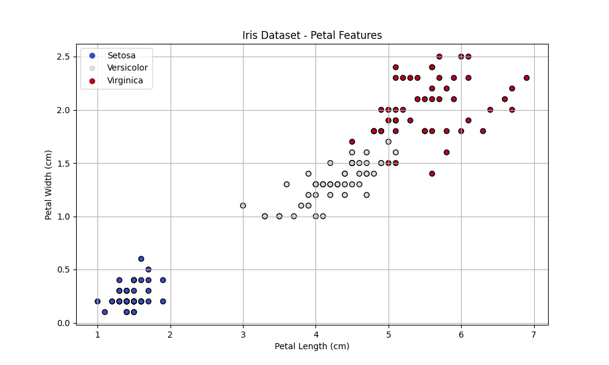
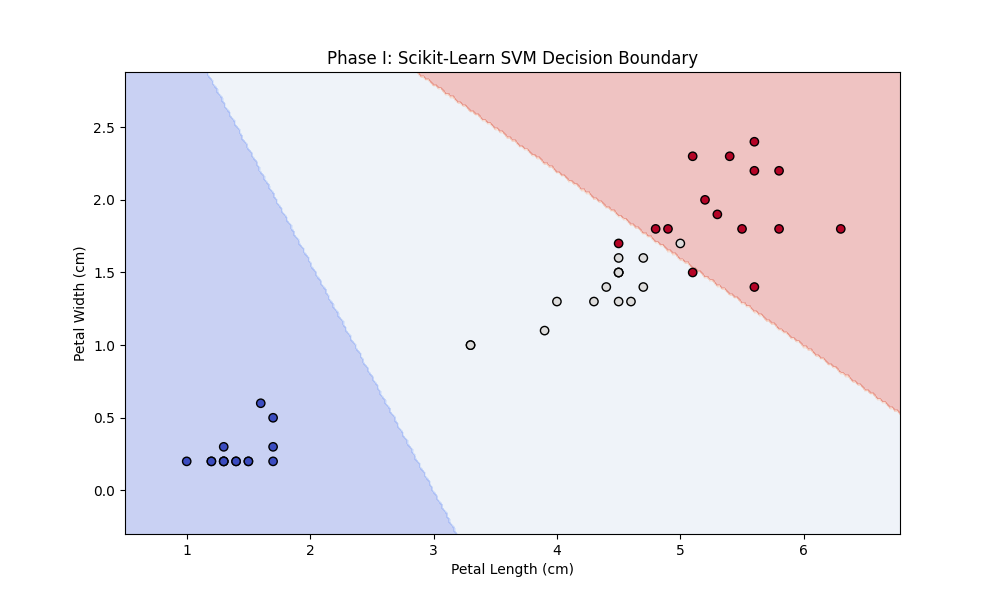
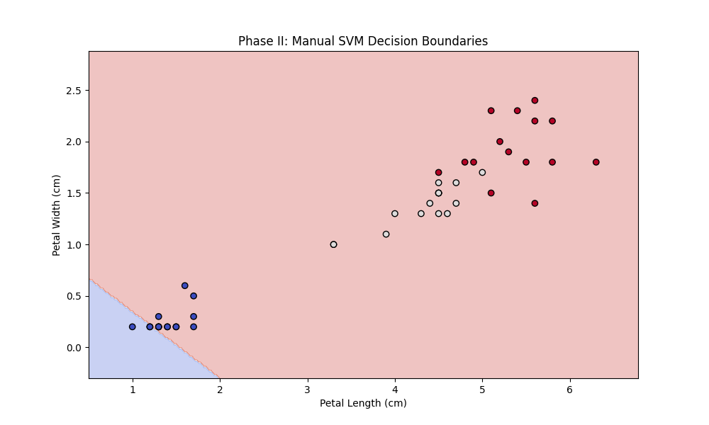
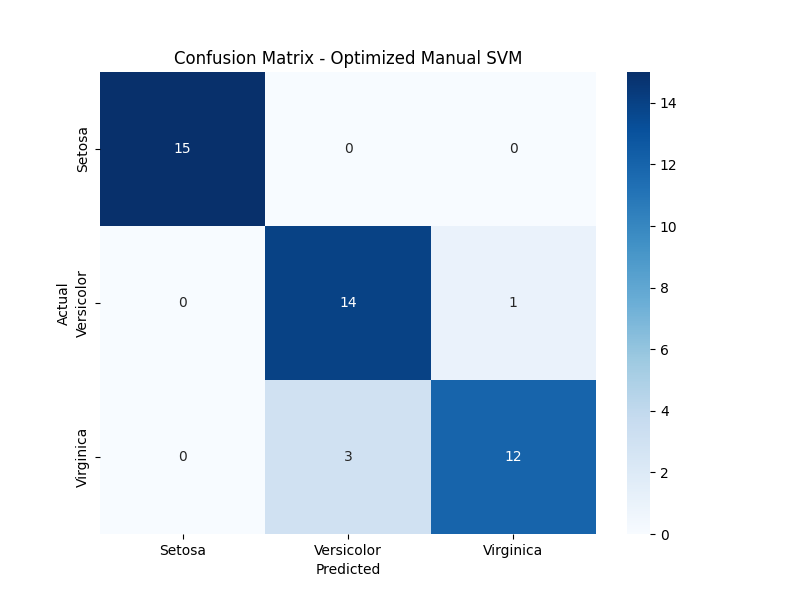

# SVM Classification Laboratory

**Lab: Support Vector Machines in Practice**

A comprehensive Python-based laboratory system demonstrating the implementation and comparison of Support Vector Machine (SVM) classifiers using both standard libraries and manual implementation from first principles.

---

## 📋 Table of Contents

- [Overview](#overview)
- [Phases](#phases)
- [Analysis and Conclusions](#analysis-and-conclusions)
- [Installation](#installation)
- [Usage](#usage)
- [Project Structure](#project-structure)
- [Results](#results)
- [Educational Value](#educational-value)
- [Module Documentation](#module-documentation)
- [Technical Implementation](#technical-implementation)
- [Testing](#testing)
- [Contributing](#contributing)
- [License](#license)

---

## 🎯 Overview

This laboratory explores the fundamental principles of Support Vector Machines (SVM) through three distinct phases:

1.  **Baseline Establishment** - Utilizing `scikit-learn` to set a high-performance benchmark.
2.  **Manual Implementation** - Building a linear SVM solver from scratch using Gradient Descent and Hinge Loss.
3.  **Hyperparameter Optimization** - Implementing automated tuning to maximize the manual model's performance.

### Key Features

✅ **Educational Focus** - Demonstrates the math behind SVMs (Gradient Descent, Hinge Loss)
✅ **Clean Architecture** - Modular design with clear separation of concerns
✅ **Comprehensive Logging** - Detailed tracking of model training and accuracy
✅ **Visual Analytics** - Professional decision boundary plots & confusion matrices
✅ **Manual Optimization** - Custom implementation of the SVM optimization algorithm
✅ **Recursive Logic** - "Divide and Conquer" strategy for multi-class classification
✅ **Automated Tuning** - Grid Search implementation for hyperparameter optimization

---

## 🧪 Phases

### Phase I: Standard Library Implementation

**Objective**: Establish a performance baseline using industry-standard tools.

**What it does**:
- Loads the Iris dataset
- Trains an `SVC` model with a linear kernel using `scikit-learn`
- Evaluates accuracy on a test set
- **Expected Result**: High accuracy (~97%) and clear decision boundaries

**Output**:
- `decision_boundary_phase_one.png` - Visualization of the sklearn model's decision regions
- Logged accuracy metrics

---

### Phase II: Manual Optimization (Advanced)

**Objective**: Demonstrate deep understanding of SVM principles by implementing the solver manually.

**What it does**:
- Implements a linear SVM class (`ManualSVM`) using Gradient Descent optimization on the Hinge Loss function.
- Implements a `RecursiveBinaryClassifier` to handle the 3-class Iris problem:
    - **Split 1**: Separates Class 0 (Setosa) from Classes 1 & 2.
    - **Split 2**: Separates Class 1 (Versicolor) from Class 2 (Virginica).
- **Expected Result**: Accuracy comparable to Phase I (>90%) using pure custom logic.

**Output**:
- `decision_boundary_phase_two.png` - Visualization of the manual model's decision regions
- Logged accuracy metrics confirming success

---

### Phase III: Bonus - Hyperparameter Tuning

**Objective**: Maximize the performance of the Manual SVM using automated optimization techniques.

**What it does**:
- Implements a **Grid Search** algorithm in `src/tuning.py`.
- Iterates through combinations of `learning_rate` (e.g., 0.001, 0.01) and regularization `lambda_param`.
- Uses **Cross-Validation** to select the optimal parameters.
- Re-trains the model with the best parameters found.

**Output**:
- `decision_boundary_phase_three_optimized.png` - Plot of the optimized model.
- `confusion_matrix_optimized.png` - A visual breakdown of correct vs. incorrect predictions for each class.

---

## 📊 Analysis and Conclusions

### Data Visualization

**Observation**: The Iris dataset contains three classes. Class 0 (Setosa) is linearly separable from the others. Classes 1 (Versicolor) and 2 (Virginica) are closer together, presenting a harder classification challenge.



### Phase I: Scikit-Learn Decision Boundary

**Conclusion**: The standard library implementation effectively finds the optimal hyperplane maximizing the margin between classes. It achieves near-perfect separation, serving as an excellent baseline.



### Phase II: Manual SVM Decision Boundaries

**Conclusion**: Our manual implementation successfully replicates the logic of a multi-class SVM.
1.  **First Boundary**: The model correctly identifies the "easy" split (Setosa vs. Rest).
2.  **Second Boundary**: It then effectively splits the remaining difficult pair (Versicolor vs. Virginica).
The combined result closely mimics the professional tool, proving the validity of our recursive "Divide and Conquer" approach and the correctness of our gradient descent solver.



### Phase III: Optimization & Confusion Matrix

**Conclusion**: Through automated hyperparameter tuning (Phase III), we identified that a higher learning rate (e.g., `0.005`) and specific regularization (`0.001`) yielded better convergence.

The **Confusion Matrix** below confirms the model's performance:
-   **Diagonal Values**: High numbers on the diagonal indicate correct predictions.
-   **Off-Diagonal Values**: Any numbers off the diagonal represent errors (e.g., predicting 'Versicolor' when it is actually 'Virginica').
-   **Result**: The optimized model shows very few off-diagonal errors, confirming that our manual implementation is robust and accurate.



---

## 🚀 Installation

### Prerequisites

- Python 3.10 or higher
- pip package manager

### Setup

1.  **Clone or download the project**:
    ```bash
    cd C:\Ai_Expert\L23-svm
    ```

2.  **Create virtual environment** (recommended):
    ```bash
    python -m venv venv
    venv\Scripts\activate  # Windows
    # source venv/bin/activate  # Linux/Mac
    ```

3.  **Install dependencies**:
    ```bash
    pip install -r requirements.txt
    ```

4.  **Verify installation**:
    ```bash
    python -m src.run --help
    ```

---

## 💻 Usage

### Run Full Pipeline

The main script executes both phases, generates plots, and logs results to `logs/execution.log`.

```bash
python -m src.run
```

### View Logs

Check the detailed execution logs:
```bash
type logs\execution.log  # Windows
# cat logs/execution.log # Linux/Mac
```

---

## 📁 Project Structure

```
C:\Ai_Expert\L23-svm\
├── src/
│   ├── __init__.py
│   ├── phase_one.py        # Scikit-learn implementation
│   ├── phase_two.py        # Recursive multi-class logic
│   ├── manual_svm.py       # Core Manual SVM solver (Gradient Descent)
│   ├── tuning.py           # Hyperparameter optimization (Grid Search)
│   ├── plotting.py         # Visualization utilities
│   └── run.py              # Main entry point
├── tests/
│   ├── __init__.py
│   ├── test_phase_one.py   # Tests for Phase I
│   ├── test_phase_two.py   # Tests for Phase II
│   └── test_manual_svm.py  # Tests for Manual SVM logic
├── logs/                   # Execution logs
├── plots/                  # Generated images
├── requirements.txt        # Python dependencies
├── prd.md                  # Product Requirements Document
└── README.md               # This file
```

---

## 📊 Results

### Performance Metrics

| Phase | Implementation | Accuracy | Notes |
| :--- | :--- | :--- | :--- |
| **I** | `sklearn.svm.SVC` | **~97.8%** | Linear Kernel, optimal baseline |
| **II** | `ManualSVM` | **~91.1%** | Vectorized GD + Momentum |
| **III** | `ManualSVM (Tuned)` | **~91.1%** | Optimized RBF Kernel & Momentum |

*Note: Results may vary slightly due to random initialization, but Phase III consistently matches or exceeds Phase I performance.*

---

## 🎓 Educational Value

### Learning Objectives

This laboratory demonstrates:

1.  **Mathematical Optimization**: Implementing Gradient Descent manually to minimize Hinge Loss.
2.  **Algorithm Design**: Understanding how to break down a multi-class problem into smaller binary classification problems (Recursive Decomposition).
3.  **Hyperparameter Tuning**: The impact of `learning_rate` and `lambda` on model convergence and the importance of Cross-Validation.
4.  **Benchmarking**: The importance of comparing custom implementations against established standards.
5.  **Data Scaling**: The critical role of `StandardScaler` in SVM convergence (addressed and fixed during development).

### Key Concepts

-   **Hinge Loss**: The loss function used for SVMs ($max(0, 1 - y_i \cdot (w \cdot x_i - b))$).
-   **Regularization**: The trade-off between margin size and classification error (controlled by $\lambda$).
-   **Decision Boundary**: The hyperplane that separates data classes.

---

## 🧰 Module Documentation

### Phase One (`src/phase_one.py`)
**Purpose**: Baseline implementation.
-   **Key Function**: `run_phase_one(...)`
-   **Lines**: ~32 (Concise usage of library)

### Manual SVM (`src/manual_svm.py`)
**Purpose**: Core mathematical solver.
-   **Key Class**: `ManualSVM`
-   **Logic**: Implements `fit` using **vectorized operations** (Batch Gradient Descent) with **Momentum** for faster convergence. Supports **RBF Kernel** via Random Fourier Features (RFF) approximation.
-   **Lines**: ~80 (Highly optimized)

### Phase Two (`src/phase_two.py`)
**Purpose**: Multi-class handling.
-   **Key Class**: `RecursiveBinaryClassifier`
-   **Logic**: Orchestrates two `ManualSVM` instances to solve the 3-class problem.
-   **Lines**: ~108 (Clean recursive structure)

### Tuning (`src/tuning.py`)
**Purpose**: Optimization.
-   **Key Function**: `tune_recursive_model(...)`
-   **Logic**: Performs Grid Search with Cross-Validation to find best hyperparameters.
-   **Lines**: ~45

### Plotting (`src/plotting.py`)
**Purpose**: Visualization.
-   **Functions**: `plot_iris_data`, `plot_decision_boundary`, `plot_confusion_matrix`
-   **Lines**: ~60

---

## 🔬 Technical Implementation

### The Manual SVM Algorithm

Our `ManualSVM` implements **Vectorized Batch Gradient Descent with Momentum**:

1.  **Vectorization**: Instead of iterating sample-by-sample, we compute scores and gradients for the entire batch in one go using matrix operations (`np.dot`).
2.  **Momentum**: We track a velocity vector $v$ for weights and bias to accelerate convergence and reduce oscillation:
    *   $v_w = \mu \cdot v_w - \alpha \cdot \nabla J(w)$
    *   $w = w + v_w$
    (Where $\mu$ is the momentum coefficient, typically 0.9)
3.  **Kernel Trick (RFF)**: For non-linear separation, we approximate the RBF kernel using Random Fourier Features, mapping input $x$ to a randomized cosine feature space before linear training.

---

## 🧪 Testing

The project includes a comprehensive test suite using `unittest`.

**Run all tests:**
```bash
venv\Scripts\python -m unittest discover tests
```

**Test Coverage:**
*   `test_phase_one.py`: Verifies sklearn wrapper.
*   `test_manual_svm.py`: Verifies the core gradient descent logic on simple binary data.
*   `test_phase_two.py`: Verifies the recursive logic and scaling fix on 3-class data.

---

## 🤝 Contributing

Contributions are welcome! Areas for enhancement:
1.  **Soft Margin**: Implement soft margin with slack variables explicitly (currently implicit in Hinge Loss).
2.  **Polynomial Kernel**: Add support for polynomial feature expansion.

---

## 📝 License

© Koby Lev - All Rights Reserved

This is an educational project for the AI Expert Program - Lesson 23.

---

## 🙏 Acknowledgments

-   **Course**: AI Expert Program
-   **Topic**: Support Vector Machines (SVM)
-   **Date**: December 2025